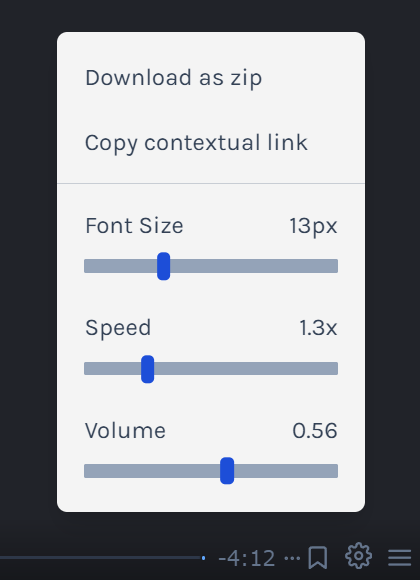

# [JSL09] Submission: Personal Dashboard Chrome Extension

You will:
1. Use the provided Starter Code Repository: https://github.com/CodeSpace-Academy/Module_09_StudentNo_Classcode_Group_Name-Surname_JSL09
2. Code your solution.
3. Commit changes to your GitHub repository.
4. Submit the GitHub Repository Link to the LMS [JSL09] Submission Project Tab.

In this project you will follow along with the Scrimba Promise Rejection capstone to create a Personal Dashboard for your Chrome Browser. Note you are only required to submit the project code. You DO NOT need to submit the deployed Chrome extension. 

Scrimba Reference Link: https://scrimba.com/learn/frontend/promise-rejection-coc4a4e4d8d208ab33b190dd5

Note that this background image is dynamically generated so your's will look different.

## What You Need to Do:

1. Clone the provided Starter Code Repository to your local development environment (e.g., VSCode): https://github.com/CodeSpace-Academy/Module_09_StudentNo_Classcode_Group_Name-Surname_JSL09
2. Open the cloned project in your code editor.
3. Code your solution for the challenge as per the provided instructions.
4. If you have coded your Personal Dashboard challenge in Scrimba, you will need to download the zip folder of your project files. Unzip the project files into your JSL09 project repo on GitHub. Make sure to NOT use the Scrimba README. Instead you will keep your starter code README.
5. Commit your changes to your local Git repository with meaningful commit messages.
6. Push your local Git repository to your GitHub account.
7. Verify that the changes have been successfully pushed to your GitHub repository.

You can download your Scrimba files in the bottom right hand corner of the Scrimba IDE panel. 

## What You Need to Include:

1. Ensure that your code includes the necessary modifications to meet the challenge requirements.
2. Your GitHub repository should contain the updated code files.

## How We'll Assess Your Work:

1. We will review your GitHub repository to ensure that it contains the updated code files.
2. We will assess the modifications made to the code to verify that they effectively meet the challenge requirements.
3. We will consider the commit history and meaningful commit messages to evaluate your coding process.

